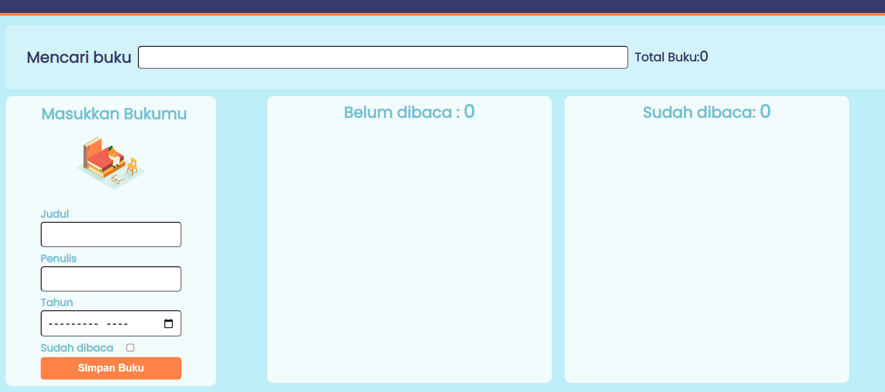

# Bookshelf-frontend

📕 &nbsp;**about website**

**English**

This website can store book titles, authors, years and grouped into read and unread shelves. Using it with the help of web storage & DOM

**bahasa**

website ini dapat menyimpan judul buku, penulis ,tahun dan di kelompokan ke rak yang sudah di baca dan belum dibaca.dengan menggunakan dengan bantuan web storage dan DOM

<b>🛠️&nbsp;&nbsp;Languages&nbsp;and&nbsp;Tools</b>

 

## result

